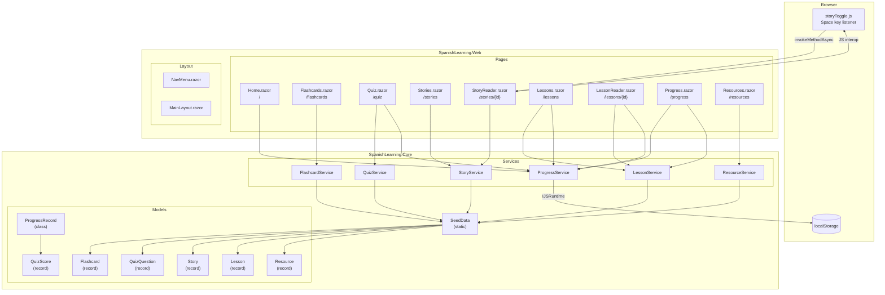

# 🇪🇸 Spanish Learning App

## Summary

A Blazor Server web application for learning Spanish through interactive flashcards, quizzes, short stories, and structured lessons — all running locally with zero external dependencies. Progress is tracked per-user in the browser's `localStorage`, so lessons completed and quiz scores persist across sessions without requiring a database or login. The app ships with fully seeded content (22 vocabulary cards, 10 quiz questions, 3 lessons, 2 bilingual stories, and 7 curated resource links), making it immediately usable out of the box.

---

## Features

- **Flashcards** — 22 vocabulary cards across Greetings, Numbers, and Food categories with click-to-flip and category filtering
- **Quizzes** — 10 multiple-choice questions served in random order, with per-answer feedback, explanations, and score persistence
- **Short Stories** — Two bilingual stories (beginner + intermediate); hold the **Space bar** to reveal the English translation while reading Spanish
- **Lessons** — Three structured lessons (Greetings, Numbers 1–20, Present Tense Verbs) with sectioned content and "Mark as Complete" tracking
- **Progress Tracker** — Dashboard showing lessons completed and full quiz score history (date, score, total)
- **Resources** — Curated links to 7 high-quality external Spanish learning tools (Duolingo, Forvo, RAE dictionary, etc.)
- **Persistent Progress** — All progress stored in browser `localStorage` — survives page reloads with no account required
- **Radzen UI** — Polished component library with Bootstrap 5 styling throughout

---

## Technical Architecture



---

## Getting Started

### Prerequisites

- [.NET 10 SDK](https://dotnet.microsoft.com/download/dotnet/10.0)

### Build

```powershell
cd SpanishLearning.Web
dotnet build
```

### Run

```powershell
dotnet run --project SpanishLearning.Web
```

Then open your browser to `https://localhost:5001` (or the HTTPS URL shown in the terminal).

### Run Tests

```powershell
dotnet test
```

### Solution Structure

```
SpanishLearningApp.slnx
├── SpanishLearning.Core/          # Domain models, services, seed data
├── SpanishLearning.Web/           # Blazor Server app (pages, layout, JS)
├── SpanishLearning.Core.UnitTests/
└── SpanishLearning.Web.UnitTests/
```
