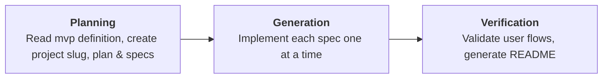

# PocGenerator

> [!WARNING]
> This app runs Copilot in YOLO mode and automatically approves anything Copilot wants to do. The app is limited in scope and it tells Copilot to do very specific things, but it's good to keep in mind for caution.

> [!NOTE]
> This app works, but is very much a work in progress. See the [Future Work](Future%20work/FEATURE-IDEAS.md) folder for my planned features and ideas.

A .NET console app that takes an app idea and generates a runnable proof-of-concept (POC) of it using the GitHub Copilot SDK. It typically takes around 30-90 minutes to run and uses a maximum of 12 premium requests (x the multiplier for the model used).

## Running the app

To run, put your app description at `PocGenerator/mvp-definition/mvp.md` (with additional optional files you want it to have as context), then run `dotnet run --project PocGenerator` from the repo root.

## Output

The app will produce a new C# solution inside the `PocGenerator/mvp-outputs/mvp.md` directory. Inside that directory, aside from the project itself, you will find a few other files:

| File / Folder | Description |
|---|---|
| `mvp-definition/` | A copy of the original definition file(s) for your own reference |
| `implementation-plan.md` | The high-level plan Copilot produced before writing the specs |
| `Specs/` | Per-feature spec files derived from the plan |
| `fixes.md` | Copilot is prompted to put any fixes it needs to make from its own mistakes in this file. For your own reference for things that might be good future improvements |

## Process

The app goes through 3 phases to generate an app.

### Phase 1: Planning

*1 premium request*

- Reads `PocGenerator/mvp-definition/mvp.md` as the idea input (along with any other optional files you want to include as context in that folder)
- Creates a project slug, a project plan, and smaller, broken down spec files based on that plan (max 10 specs allowed)
- Creates a timestamped output folder under `PocGenerator/mvp-outputs/`

### Phase 2: Generation

*1 premium request per spec file (max 10)*

- Works through each spec one at a time
- Sends each spec to Copilot and implements the requirements, verifying as it implements

### Phase 3: Verification

*1 premium request*

- Asks Copilot to validate each user flow and fix if necessary
- Generates a README for the finished MVP

## Important folders

- `PocGenerator/mvp-definition/mvp.md` — Edit this file to describe the app you want to build
- `PocGenerator/mvp-outputs/` — Each run creates a new timestamped folder here with the generated project

## Project scripts (`PocGenerator/ProjectScripts/`)

PowerShell scripts that scaffold new .NET projects. Rather than trusting AI to create new C# projects the same way every time, these scripts determinstically create projects exactly how they should be set up. Copilot calls them as tools during generation so that project scaffolding is consistent.

Supported project types (a single app will probably have multiple of these types):

- **Blazor** — Blazor web app (`create-blazor-project.ps1`)
- **Console** — Console app (`create-console-project.ps1`)
- **Database** — EF Core database project (`create-db-project.ps1`)
- **Library** — Class library (`create-library-project.ps1`)
- **Test** — xUnit test project (`create-test-project.ps1`)

## Logs

Logs are currently buried inside the actual app at `PocGenerator/bin/Debug/net10.0/logs/`.

There are info, trace, and Copilot-level logs. The Copilot-level logs all Copilot event (which there are quite a lot of).

## Utilities (`Utilities/`)

Manually-ran scripts for inspecting log output after a run:

- `Find-UniqueLogEvents.ps1` — Parses Copilot SDK log files and reports all unique event names, optionally filtered by pattern or exported to CSV. Useful for understanding what the SDK is doing across a full run.
- `Find-ViewToolUsage.ps1` — Scans log files for every `view` tool invocation, normalizes paths relative to the MVP output folder, and counts how many times each file was viewed per-run and in aggregate. Helpful for spotting which files Copilot revisits most.
